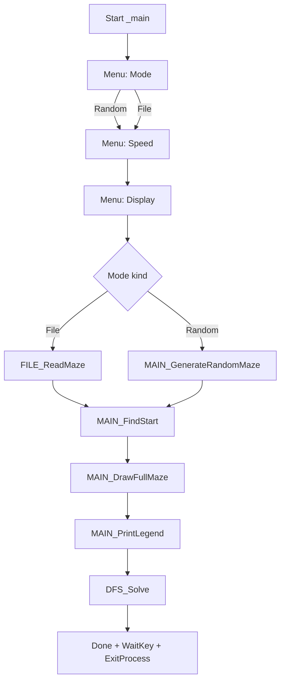

# Detailed Report (Win32 NASM Maze Solver)

## 1) Project Scope

Maze solver using Depth-First Search (DFS) with a console UI.

- Platform: Windows 32-bit (PE32)
- Assembler: NASM (`-f win32`)
- Linker: GCC (`-m32`) + `kernel32`
- UI: WinAPI console (cursor, colors, screen fill)

Primary build target:
- [build.bat](file:///d:/desktop/KienTrucMayTinh-HopNgu/New%20folder/doan/Asm-maze-solver-win32-nasm/build.bat#L1-L19) → `maze_solver.exe`

## 2) Repository Layout

Modules (for independent student reports):
- SV1 (UI): [ui.asm](file:///d:/desktop/KienTrucMayTinh-HopNgu/New%20folder/doan/Asm-maze-solver-win32-nasm/UI/ui.asm)
- SV2 (File I/O): [file.asm](file:///d:/desktop/KienTrucMayTinh-HopNgu/New%20folder/doan/Asm-maze-solver-win32-nasm/IO/file.asm)
- SV3 (Core/DFS + generator): [core.asm](file:///d:/desktop/KienTrucMayTinh-HopNgu/New%20folder/doan/Asm-maze-solver-win32-nasm/core/core.asm)
- Integration entrypoint: [main.asm](file:///d:/desktop/KienTrucMayTinh-HopNgu/New%20folder/doan/Asm-maze-solver-win32-nasm/main.asm)

## 3) Runtime Flow

The executable follows a 3-stage menu and then runs solve:
- Mode: Random (Easy/Medium/Hard) or Load from `maze.txt`
- Speed: Slow/Normal/Fast → controls `ui_delay_ms`
- Display: Minimal/Normal/Dense → controls `dfs_display_mode`

Mermaid flowchart:



Relevant integration code:
- After load/generate → draw maze → legend → solve: [main.asm:L293-L329](file:///d:/desktop/KienTrucMayTinh-HopNgu/New%20folder/doan/Asm-maze-solver-win32-nasm/main.asm#L293-L329)

## 4) Data Model and Memory Layout

All maze operations use a 1D array `maze` indexed by:

`index = y * cols + x`

Core indexing routine:
- [MAIN_GetIndex](file:///d:/desktop/KienTrucMayTinh-HopNgu/New%20folder/doan/Asm-maze-solver-win32-nasm/core/core.asm#L111-L126)

Main data symbols (allocated in [main.asm](file:///d:/desktop/KienTrucMayTinh-HopNgu/New%20folder/doan/Asm-maze-solver-win32-nasm/main.asm#L25-L69)):
- `rows`, `cols`: maze dimensions
- `maze[1600]`: current maze grid (up to 30×30)
- `maze_work[1600]`: optional work copy
- `stack_x[1600]`, `stack_y[1600]`, `stack_top`: software stack for DFS
- `ui_delay_ms`: animation delay in milliseconds
- `dfs_display_mode`: 0 Minimal, 1 Normal, 2 Dense
- `dfs_steps`: DFS step counter (also used by on-screen status)

Cell encoding in `maze`:
- `'1'` wall
- `'0'` path
- `'S'` start
- `'E'` end
- `'V'` visited (DFS internal marker)

Screen mapping:
- `'1'` → `#`
- `'0'` → `.`

## 5) UI System (SV1)

### 5.1 WinAPI functions used

The console UI uses WinAPI to avoid BIOS/DOS interrupts:
- cursor: `SetConsoleCursorPosition`
- output: `WriteConsoleA`
- input: `ReadConsoleA`
- clear/fill: `GetConsoleScreenBufferInfo`, `FillConsoleOutputCharacterA`, `FillConsoleOutputAttribute`
- colors: `SetConsoleTextAttribute`
- animation: `Sleep`

### 5.2 Register discipline (why it matters)

Every UI procedure preserves registers to avoid corrupting the caller state.

Example:
- [UI_DrawChar](file:///d:/desktop/KienTrucMayTinh-HopNgu/New%20folder/doan/Asm-maze-solver-win32-nasm/UI/ui.asm#L128-L154) saves/restores the general registers before calling `WriteConsoleA`.

### 5.3 Clean layout utilities

To keep the UI “clean” (no leftover characters when rewriting the status/legend lines), the UI provides:
- [UI_ClearLine](file:///d:/desktop/KienTrucMayTinh-HopNgu/New%20folder/doan/Asm-maze-solver-win32-nasm/UI/ui.asm#L62-L102)

Code excerpt (clears an entire row using the current buffer width):

```asm
UI_ClearLine:
    call _GetConsoleScreenBufferInfo@8
    movzx ecx, word [ebp-22]
    movzx eax, word [coord_y]
    shl eax, 16
    call _FillConsoleOutputCharacterA@20
    call _FillConsoleOutputAttribute@20
```

Status line is cleared before redraw in:
- [DFS_UpdateStatus](file:///d:/desktop/KienTrucMayTinh-HopNgu/New%20folder/doan/Asm-maze-solver-win32-nasm/core/core.asm#L415-L451)

### 5.4 Color policy

Console attributes (simple, readable defaults):
- Default: 7
- Wall `#`: 8
- Start `S`: 10
- Current `@`: 11
- End `E`: 12
- Visited `*`: 14

Legend is printed with per-symbol colors:
- [MAIN_PrintLegend](file:///d:/desktop/KienTrucMayTinh-HopNgu/New%20folder/doan/Asm-maze-solver-win32-nasm/main.asm#L358-L423)

### 5.5 Fixed-width number printing (for live status)

To display a stable status without flicker/alignment issues:
- [UI_PrintDec2](file:///d:/desktop/KienTrucMayTinh-HopNgu/New%20folder/doan/Asm-maze-solver-win32-nasm/UI/ui.asm#L269-L298)
- [UI_PrintDec4](file:///d:/desktop/KienTrucMayTinh-HopNgu/New%20folder/doan/Asm-maze-solver-win32-nasm/UI/ui.asm#L300-L333)

## 6) File I/O (SV2)

`FILE_ReadMaze` loads `maze.txt` into `maze` and sets `rows/cols`.

Demo run (module-only):

```powershell
cd "Asm-maze-solver-win32-nasm\IO"
.\build_io_demo.bat
.\io_demo.exe
```

Integration run expects `maze.txt` next to `maze_solver.exe`:
- [maze.txt](file:///d:/desktop/KienTrucMayTinh-HopNgu/New%20folder/doan/Asm-maze-solver-win32-nasm/maze.txt)

## 7) Core Solver (SV3)

### 7.1 DFS algorithm

DFS is implemented using a software stack to keep state in `stack_x/stack_y`.

Procedures:
- [DFS_Push](file:///d:/desktop/KienTrucMayTinh-HopNgu/New%20folder/doan/Asm-maze-solver-win32-nasm/core/core.asm#L171-L186)
- [DFS_Pop](file:///d:/desktop/KienTrucMayTinh-HopNgu/New%20folder/doan/Asm-maze-solver-win32-nasm/core/core.asm#L188-L201)
- [DFS_Solve](file:///d:/desktop/KienTrucMayTinh-HopNgu/New%20folder/doan/Asm-maze-solver-win32-nasm/core/core.asm#L223-L413)

Neighbor exploration order (deterministic):
- Right → Down → Left → Up (see [core.asm:L359-L393](file:///d:/desktop/KienTrucMayTinh-HopNgu/New%20folder/doan/Asm-maze-solver-win32-nasm/core/core.asm#L359-L393))

### 7.2 Boundary checks (signed correctness)

Negative values must be detected using signed checks:
- [MAIN_IsValid](file:///d:/desktop/KienTrucMayTinh-HopNgu/New%20folder/doan/Asm-maze-solver-win32-nasm/core/core.asm#L128-L169) uses `test reg, reg` + `js` for `< 0`.

This avoids “underflow becomes huge unsigned” bugs when using `dec` on coordinates.

### 7.3 Display modes (reduce clutter)

DFS visualization is controlled by `dfs_display_mode`:
- Minimal: show `@` current, then restore underlying cell (no `*`)
- Normal: show `@`, only draw `*` every 4 steps
- Dense: show `@`, always draw `*`

Implementation:
- [DFS_Draw*](file:///d:/desktop/KienTrucMayTinh-HopNgu/New%20folder/doan/Asm-maze-solver-win32-nasm/core/core.asm#L260-L357)

Code excerpt (mode selection):

```asm
DFS_Draw:
    inc dword [dfs_steps]
    call DFS_UpdateStatus
    mov al, [dfs_display_mode]
    cmp al, 0
    je DFS_DrawMinimal
    cmp al, 1
    je DFS_DrawNormal
    jmp DFS_DrawDense
```

### 7.4 On-screen “debug log”

Each DFS step updates:

`Step:#### X:## Y:##`

Implementation:
- [DFS_UpdateStatus](file:///d:/desktop/KienTrucMayTinh-HopNgu/New%20folder/doan/Asm-maze-solver-win32-nasm/core/core.asm#L415-L451)

## 8) Random Maze Generation

The generator guarantees a path from `(1,1)` to `(cols-2, rows-2)` by first carving a path, then adding random openings.

Entry:
- [MAIN_GenerateRandomMaze](file:///d:/desktop/KienTrucMayTinh-HopNgu/New%20folder/doan/Asm-maze-solver-win32-nasm/core/core.asm#L469-L611)

Pseudo-flow:

```mermaid
flowchart TD
  A[Fill all '1'] --> B[Carve guaranteed path '0']
  B --> C[Randomly open some remaining walls]
  C --> D[Write 'S' at (1,1)]
  D --> E[Write 'E' at (cols-2,rows-2)]
```

## 9) Build & Run

Build full program:

```powershell
cd "Asm-maze-solver-win32-nasm"
.\build.bat
.\maze_solver.exe
```

## 10) Demo Checklist for Instructor

- Show module split: UI / IO / Core + main integration.
- Show register discipline: UI functions preserve registers to avoid corrupting DFS loops.
- Show `MUL` side-effect concept: `EDX:EAX` overwrite risk in arithmetic-heavy code.
- Show signed boundary correctness using `js`.
- Run solver with:
  - Dense+Slow to demonstrate animation intensity
  - Minimal/Normal to demonstrate “readable” mode
